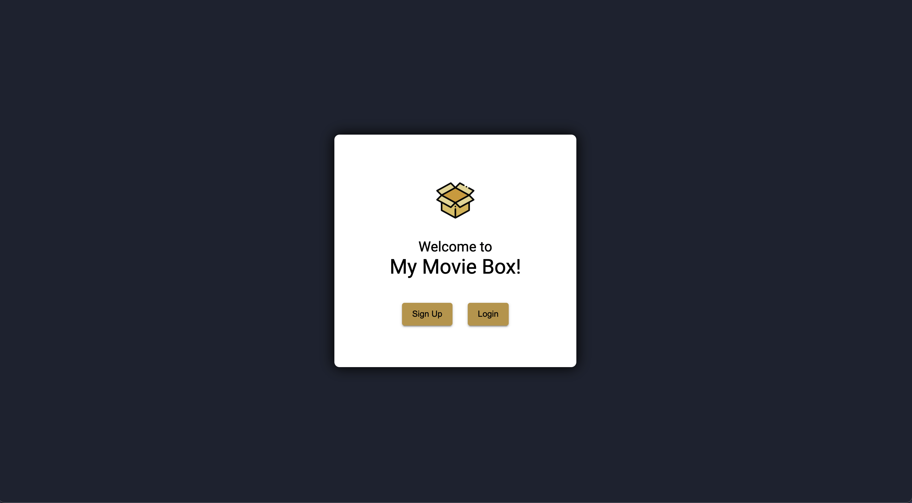

# myMovieBox - Angular - Client

<p align="center">
    
    
    
</p>

The objective of this project is to build the client-side for an application called myMovieBox, using **Angular** and based on its existing server-side code (REST API and database), with supporting documentation.

This project was generated with [Angular CLI](https://github.com/angular/angular-cli) version 15.2.5.

### Key Features:

- A welcome view where users will be able to either log in or register an account.
- Once authenticated, the user should now view all movies.
- Each movie card has three dialog buttons (Genre, Director and Synopsis), that when clicked display extra information about the movie
- The movie card has also an extra button which allows the user to toggle a movie as favorite.

### Build with:

- Angular
- Angular Material
- TypeScript
- TypeDoc

### Links:

-   Live App:  [https://brunahilbert.github.io/myMovieBox-angular-client](https://brunahilbert.github.io/myMovieBox-angular-client)
-   API:  [https://github.com/brunahilbert/movie_api](https://github.com/brunahilbert/movie_api)

## Setting up myMovieBox Angular Application

### Development server

Run  `ng serve`  for a dev server. Navigate to  `http://localhost:4200/`. The application will automatically reload if you change any of the source files.

### Code scaffolding

Run  `ng generate component component-name`  to generate a new component. You can also use `ng generate directive|pipe|service|class|guard|interface|enum|module`.

### Build

Run  `ng build`  to build the project. The build artifacts will be stored in the  `dist/`  directory.

### Running unit tests

Run `ng test` to execute the unit tests via [Karma](https://karma-runner.github.io).

### Running end-to-end tests

Run `ng e2e` to execute the end-to-end tests via a platform of your choice. To use this command, you need to first add a package that implements end-to-end testing capabilities.

### Further help

To get more help on the Angular CLI use `ng help` or go check out the [Angular CLI Overview and Command Reference](https://angular.io/cli) page.

### Technical Dependencies:

```
"dependencies": {
	"@angular/animations": "^15.2.0",
	"@angular/cdk": "^15.2.7",
	"@angular/common": "^15.2.0",
	"@angular/compiler": "^15.2.0",
	"@angular/core": "^15.2.0",
	"@angular/forms": "^15.2.0",
	"@angular/material": "^15.2.7",
	"@angular/platform-browser": "^15.2.0",
	"@angular/platform-browser-dynamic": "^15.2.0",
	"@angular/router": "^15.2.0",
	"rxjs": "~7.8.0",
	"tslib": "^2.3.0",
	"zone.js": "~0.12.0"
},
"devDependencies": {
	"@angular-devkit/build-angular": "^15.2.5",
	"@angular/cli": "~15.2.5",
	"@angular/compiler-cli": "^15.2.0",
	"@types/jasmine": "~4.3.0",
	"angular-cli-ghpages": "^1.0.5",
	"jasmine-core": "~4.5.0",
	"karma": "~6.4.0",
	"karma-chrome-launcher": "~3.1.0",
	"karma-coverage": "~2.2.0",
	"karma-jasmine": "~5.1.0",
	"karma-jasmine-html-reporter": "~2.0.0",
	"typedoc": "^0.24.6",
	"typescript": "~4.9.4"
}
```